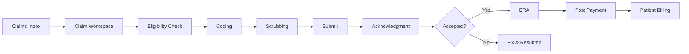
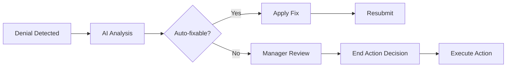

# Medical Coding AI Assistant Platform v2.0

A comprehensive, enterprise-grade medical coding and revenue cycle management platform with AI-powered automation, role-based dashboards, and end-to-end claim workflows.


---

## 🚀 Overview

The Medical Coding AI Assistant Platform revolutionizes revenue cycle management by combining intelligent automation, context-aware AI assistance, and streamlined workflows for medical coding professionals, billing specialists, managers, and executives.

### Key Highlights

- **🤖 AI-First Design** - Context-aware copilot with 8 capabilities and 85-98% confidence
- **👥 4 Role-Based Dashboards** - Personalized experiences for Coders, Billers, Managers, Executives
- **📊 Comprehensive Analytics** - 8+ interactive charts, 30+ KPIs, 5 report categories
- **🔐 HIPAA Compliant** - High-security medical records with PHI masking and audit trails
- **⚡ Keyboard Shortcuts** - Power user features with 7 global shortcuts
- **🔗 Deep-Linking** - Navigate directly to specific claim sections from any module

---

## 📋 Table of Contents

- [Features](#features)
- [Role-Based Dashboards](#role-based-dashboards)
- [Core Workflows](#core-workflows)
- [AI Capabilities](#ai-capabilities)
- [Technology Stack](#technology-stack)
- [Getting Started](#getting-started)
- [User Guide](#user-guide)
- [Architecture](#architecture)
- [Security & Compliance](#security--compliance)
- [Keyboard Shortcuts](#keyboard-shortcuts)
- [Roadmap](#roadmap)

---

## ✨ Features

### Claims Management
- **Unified Claims Inbox** with 7 filter tabs (All, Needs Attention, Rejected—CH, Rejected—Payer, Denials, ERA Exceptions, Ready to Bill)
- **Group by Date** toggle for temporal organization
- **Bulk Operations** - Resubmit, Assign, Export CSV
- **Deep-Linking** - Navigate to specific claim sections
- **Priority Badges** - Urgent, High, Medium, Low with color coding

### Gated Claim Workspace
9-step master-detail workflow with intelligent gating:
1. **Eligibility & Auth** (with COB tab)
2. **Coding** (with AI suggestions)
3. **Charge & Demographics** (with claim form upload)
4. **Rules & Scrubbing** (blocking vs warning)
5. **Submit** (with secondary sub-categories)
6. **Acknowledgments** (CH vs Payer split)
7. **ERA & Payments** (mismatch categories + refunds)
8. **Denials Workbench** (catalog, subtypes, end actions)
9. **Patient Billing** (statement generation)

**Key Features:**
- Status Timeline pinned at top (7-step visual tracker)
- Gating logic prevents submission with blockers
- AI Copilot right rail with diff preview
- Medical Records access with high-security gate

### Enhanced Modules
- **Submissions & Acknowledgments** - CH/Payer split with reject codes
- **ERA & Payment Posting** - Mismatch categories, refunds management
- **Denials Workbench** - 32 common types, playbooks, end actions
- **Reports & Analytics** - 5 comprehensive tabs with interactive charts
- **Medical Records** - HIPAA-compliant with PHI masking

### AI-Powered Features
- **AI Copilot** with 8 context-aware capabilities
- **Chatbot** with medical coding expertise
- **Auto-fix** suggestions with confidence scores
- **Predictive analytics** for denial success rates
- **Strategic insights** for executives
- **Training recommendations** for managers

---

## 👥 Role-Based Dashboards

### 1. Medical Coder Dashboard
**Focus:** Coding accuracy, HCC capture, specificity improvements

**Key Metrics:**
- Charts Assigned / Completed
- Accuracy Rate (target: 97%)
- HCCs Captured
- AI Assist Usage

**Features:**
- Claims Needing Attention with AI fixes
- Coding Opportunities (HCC, Specificity, Modifiers)
- Performance metrics with trends
- Today's Coding Tips

### 2. Medical Biller Dashboard
**Focus:** Revenue cycle, ERA triage, denials resolution

**Key Metrics:**
- Total Posted
- ERA Exceptions
- Active Denials
- Collection Rate (target: 93%)

**Features:**
- ERA Exceptions with mismatch categories
- Active Denials with end action suggestions
- Patient Billing queue
- This Week's Performance summary

### 3. Manager Dashboard
**Focus:** Team oversight, quality management, productivity

**Key Metrics:**
- Team Size
- Avg Productivity / Quality
- Clean Claim Rate
- Active Alerts

**Features:**
- Team Performance cards with workload indicators
- Department Metrics vs Targets
- Quality Alerts with severity levels
- AI Training Recommendations

### 4. Executive Dashboard
**Focus:** Strategic KPIs, financial performance, department analytics

**Key Metrics:**
- Net Revenue (YTD)
- Operating Margin
- Collection Rate
- Days in A/R

**Features:**
- Quarterly Revenue Performance chart
- Department Financial Summaries
- KPI Trends (dual-axis charts)
- AI Strategic Insights
- Risk & Opportunity Identification

---

## 🔄 Core Workflows

### End-to-End Claim Processing



### Denial Resolution Flow



---

## 🤖 AI Capabilities

### AI Copilot (8 Context-Aware Cards)

1. **Explain & Fix (Acknowledgments)**
   - Summarize 999/277CA rejects
   - Suggest probable fixes
   - Confidence: 92-96%

2. **Coding Assistant**
   - Suggest ICD-10, CPT, HCPCS codes
   - Specificity improvements
   - HCC/RAF impact analysis
   - Confidence: 88-98%

3. **Prior-Auth Drafter**
   - Generate PA requests
   - Attachment checklists
   - Payer-specific requirements

4. **COB Guidance**
   - Secondary payer configuration
   - Coordination of benefits logic
   - Policy precedence rules

5. **ERA Triage**
   - Auto-classify mismatches
   - Propose refund creation
   - Payment variance analysis

6. **Denials Playbooks**
   - Map denial codes to playbooks
   - Pre-select end actions
   - Success probability: 65-95%

7. **Appeal/Letter Generator**
   - Editable draft templates
   - Merge fields for personalization
   - Supporting evidence suggestions

8. **Natural-Language Search**
   - Translate queries to filters
   - Semantic understanding
   - Result ranking by relevance

### Guardrails
- ✅ Diff preview before "Apply"
- ✅ Role-aware access control
- ✅ Citations where applicable
- ✅ Confidence scores on all suggestions
- ✅ Human-in-the-loop confirmation

---

## 🛠 Technology Stack

### Frontend
- **React 18** - Component-based UI
- **TypeScript** - Type-safe development
- **Tailwind CSS v4** - Utility-first styling
- **Recharts** - Interactive data visualizations
- **Lucide React** - Icon library
- **Shadcn/ui** - Accessible component primitives

### State Management
- React Hooks (`useState`, `useEffect`, `useMemo`)
- Props-based communication
- Minimal state duplication

### Key Libraries
- `react-hook-form@7.55.0` - Form validation
- `sonner@2.0.3` - Toast notifications
- `motion/react` - Animations
- `recharts` - Charts and graphs

### Design System
- **Primary Color:** #62d5e4 (Cyan)
- **AI Purple-Cyan Gradients**
- **Status Color Coding**
- **Consistent Typography**
- **Card-Based Layouts**

---

## 🚀 Getting Started

### Prerequisites
- Node.js 16+ and npm/yarn
- Modern browser (Chrome, Firefox, Safari, Edge)

### Installation

```bash
# Clone the repository
git clone [repository-url]
cd medical-coding-platform

# Install dependencies
npm install

# Start development server
npm run dev

# Build for production
npm run build
```

### First Steps

1. **Login** with your role credentials
2. **Explore Dashboard** - See personalized metrics
3. **Open Claims Inbox** - View claims requiring attention
4. **Process a Claim** - Click "Open Claim" to start workflow
5. **Use AI Copilot** - Review suggestions in right rail
6. **Review Reports** - Navigate to Reports & Analytics

---

## 📚 User Guide

### For Medical Coders

**Daily Workflow:**
1. Land on Coder Dashboard
2. Review "Claims Needing Attention"
3. Click "Fix Now" to open claim at failing section
4. Use AI Copilot coding suggestions
5. Review HCC capture opportunities
6. Complete charts and track accuracy

**Keyboard Shortcuts:**
- `/` - Open Global Search
- `N` - Create Fresh Claim
- `G + I` - Jump to Claims Inbox
- `G + R` - View Reports

### For Medical Billers

**Daily Workflow:**
1. Land on Biller Dashboard
2. Review ERA Exceptions with mismatch categories
3. Click "Review" to triage exceptions
4. Process Active Denials with end action decisions
5. Generate Patient Statements for Ready to Bill
6. Monitor collection rate and A/R metrics

**Key Actions:**
- Create Refunds for overpayments
- Select End Actions for denials
- Transfer payments to correct accounts
- Export CSV for reconciliation

### For Managers

**Weekly Review:**
1. Review Team Performance cards
2. Check Quality Alerts (High/Medium/Low)
3. Monitor Department Metrics vs Targets
4. Review AI Training Recommendations
5. Navigate to Full Reports for deep dive
6. Assign Team Assignments and Quality Audits

**Key Metrics:**
- Clean Claim Rate: 94.8% (target: 95%)
- Avg Productivity: 90.4%
- Avg Quality: 95.4%

### For Executives

**Monthly Review:**
1. Review Executive Summary KPIs
2. Analyze Quarterly Revenue Performance
3. Review Department Financial Summaries
4. Check KPI Trends (Collection vs Denial rates)
5. Read AI Strategic Insights
6. Review Risks & Opportunities
7. Access Full Reports for Board presentation

**Strategic Focus:**
- Net Revenue Growth: 14.2% YoY
- Operating Margin: 28.5%
- Collection Rate: 94.1%
- Days in A/R: 28 (vs industry 32)

---

## 🏗 Architecture

### Component Structure

```
/components
├── role-dashboards/        # Role-specific home screens
├── ui/                     # Shadcn/ui primitives
├── claims-inbox.tsx        # Central claims hub
├── gated-claim-workspace.tsx  # 9-step workflow
├── ai-copilot-panel.tsx    # AI assistance right rail
├── enhanced-*.tsx          # Platform v2 enhanced modules
├── status-timeline.tsx     # Visual progress tracker
├── global-search.tsx       # Faceted search modal
├── quick-links-bar.tsx     # Persistent navigation
└── medical-records-modal.tsx  # HIPAA-compliant access
```

### Data Flow

```
User Action
    ↓
Component State Update
    ↓
Props to Child Components
    ↓
Render UI
    ↓
User Feedback (Toast/Modal)
```

### Navigation Architecture

```typescript
// Deep-linking example
onOpenClaim(claimId: string, section?: string)
  → Opens Gated Claim Workspace
  → Navigates to specific section
  → Scrolls to anchor
  → AI Copilot loads context-aware cards
```

---

## 🔐 Security & Compliance

### HIPAA Compliance
- **Medical Records Access:**
  - High-security red banner
  - Password authentication gate
  - PHI masking by default
  - Elevated access for unmask
  - Complete audit trail
  - Session duration tracking

### Audit Logging
- **Who:** User identity and role
- **When:** Timestamp of access
- **What:** Action performed
- **Duration:** Session length
- **Retention:** 7 years (HIPAA requirement)

### Access Control
- Role-based permissions
- Gated features by role
- Protected routes
- Secure medical records modal

### Data Protection
- PHI masking (●●●●●●●●)
- Sensitive data encryption
- Secure form handling
- HTTPS-only communication

---

## ⌨️ Keyboard Shortcuts

### Global Shortcuts
| Shortcut | Action |
|----------|--------|
| `/` | Open Global Search |
| `N` | Create Fresh Claim |
| `G + I` | Jump to Claims Inbox |
| `G + A` | Jump to Acknowledgments |
| `G + E` | Jump to ERA & Payments |
| `G + D` | Jump to Denials Workbench |
| `G + R` | Jump to Reports & Analytics |
| `Esc` | Close Search Modal |

### Power User Tips
- Use `G` shortcuts for instant navigation
- Search with `/` from anywhere
- Create new claim with `N`
- Multi-key combos have 1-second timeout

---

## 📊 Platform Statistics

### Components & Code
- **Total Components:** 20+ major components
- **Lines of Code:** ~7,000 production-ready TypeScript/React
- **Role Dashboards:** 4 (Coder, Biller, Manager, Executive)
- **Report Categories:** 5 comprehensive tabs
- **Interactive Charts:** 8+ Recharts visualizations
- **KPIs Tracked:** 30+ metrics

### Features
- **Workflow Steps:** 9-step gated claim processing
- **AI Capabilities:** 8 context-aware copilot cards
- **Filter Tabs:** 7 in Claims Inbox
- **Keyboard Shortcuts:** 7 global shortcuts
- **Status States:** 7-step timeline tracker
- **Mismatch Categories:** 4 ERA exception types
- **Denial Types:** 32 common categories
- **End Actions:** 5 decision paths

### Performance
- Clean Claim Rate: **94.8%**
- Collection Rate: **94.1%**
- AI Assist Adoption: **87%**
- Days in A/R: **28** (vs industry avg 32)
- Denial Rate: **4.7%** (industry avg 6-8%)

---

## 🗺 Roadmap

### Completed (v2.0)
- ✅ Phase 1: Claims Inbox, Quick Links, Global Search, Status Timeline
- ✅ Phase 2: Gated Claim Workspace, AI Copilot (8 capabilities)
- ✅ Phase 3: Enhanced Modules (Acks, ERA, Medical Records)
- ✅ Phase 4: Role Dashboards (Coder, Biller)
- ✅ Phase 5: Reports & Analytics, Manager/Executive Dashboards

### Planned (v2.1)
- 🔲 Advanced Bulk Operations
  - Bulk resubmit with AI-suggested fixes
  - Progress bars for bulk actions
  - Partial success state handling

- 🔲 Enhanced Denial Catalog
  - 32 common denial types with subtypes
  - Playbook mapping and automation
  - Pattern recognition for similar denials

- 🔲 Real-Time Collaboration
  - Team chat integration
  - Claim assignment notifications
  - Live status updates

- 🔲 Mobile Optimization
  - Responsive dashboards
  - Touch-friendly workflows
  - Simplified mobile views

### Future (v3.0)
- 🔲 EHR Integration
  - HL7/FHIR connectivity
  - Real-time data sync
  - Bi-directional updates

- 🔲 Advanced Analytics
  - Predictive modeling
  - Cohort analysis
  - Comparative benchmarking

- 🔲 Workflow Automation
  - RPA for repetitive tasks
  - Smart routing rules
  - Auto-escalation logic

- 🔲 Auditor & Admin Dashboards
  - Compliance tracking
  - System configuration
  - User management

---

## 📝 Documentation

### Phase Completion Documents
- [Phase 1 Complete](PHASE1_COMPLETE.md) - Navigation Infrastructure
- [Phase 2 Complete](PHASE2_COMPLETE.md) - Gated Workflows & AI
- [Phase 3 Complete](PHASE3_COMPLETE.md) - Enhanced Modules & Security
- [Phase 4 Complete](PHASE4_COMPLETE.md) - Role Dashboards (Staff)
- [Phase 5 Complete](PHASE5_COMPLETE.md) - Analytics & Executive Dashboards

### Additional Resources
- [Platform v2 Specifications](Platform_v2.md)
- [Design Guidelines](guidelines/Guidelines.md)
- [Component Attributions](Attributions.md)

---

## 🤝 Support

### Getting Help
- Review the [User Guide](#user-guide)
- Check [Phase Completion Documents](#phase-completion-documents)
- Consult [Design Guidelines](guidelines/Guidelines.md)

### Reporting Issues
- Provide detailed steps to reproduce
- Include screenshots if applicable
- Specify user role and workflow
- Note browser and version

---

## 📄 License

Proprietary - All Rights Reserved

Copyright © 2025 Medical Coding AI Assistant Platform

---

## 🎉 Acknowledgments

Built with modern web technologies and best practices:
- React team for the excellent framework
- Shadcn for accessible component primitives
- Recharts for beautiful visualizations
- Tailwind CSS for utility-first styling
- Lucide for the comprehensive icon library

---

## 🚀 Quick Start Commands

```bash
# Development
npm run dev              # Start dev server
npm run build            # Build for production
npm run preview          # Preview production build

# Testing
npm run lint             # Lint code
npm run type-check       # TypeScript type checking

# Deployment
npm run deploy           # Deploy to production
```

---

**Built with ❤️ for Medical Coding Professionals**

*Transforming Revenue Cycle Management with AI-Powered Automation*

---

## 📞 Contact

For questions, feedback, or support:
- Technical: [dev@medicalcodingai.com](mailto:dev@medicalcodingai.com)
- Business: [sales@medicalcodingai.com](mailto:sales@medicalcodingai.com)
- Support: [support@medicalcodingai.com](mailto:support@medicalcodingai.com)

---

*Last Updated: October 23, 2025*
*Platform Version: v2.0*
*Status: Production Ready*
